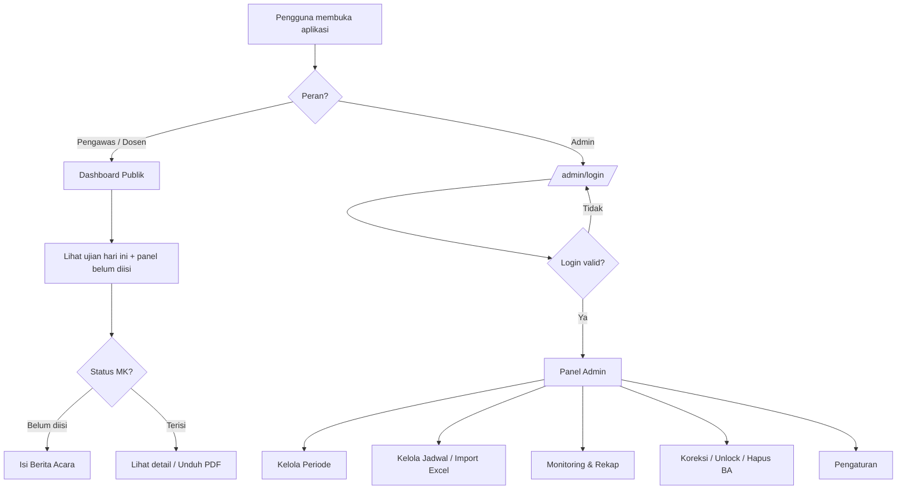
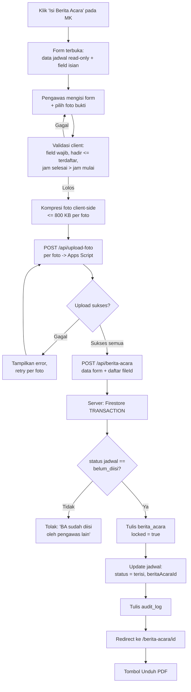
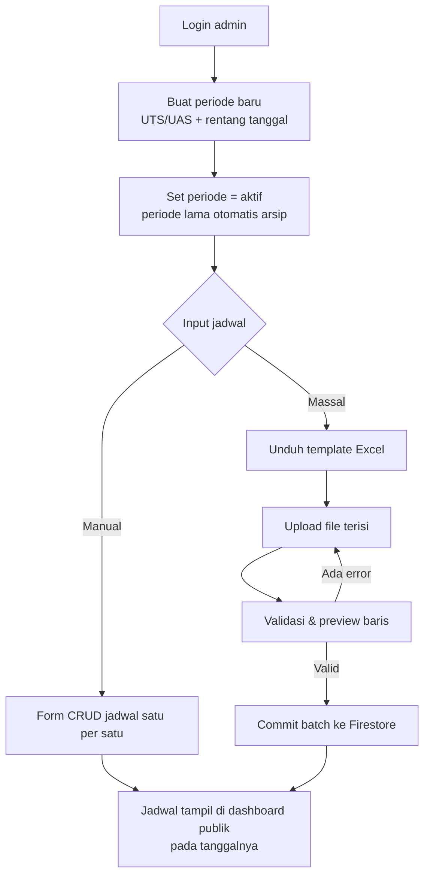
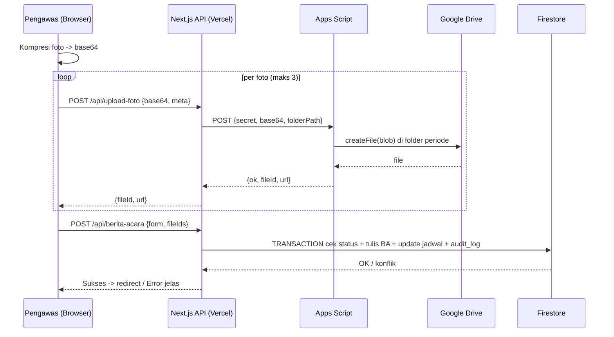

# PRD — Sistem Berita Acara Ujian (SIBAU) UTS/UAS
## Fakultas Ilmu Kesehatan — Universitas Ibnu Sina, Batam

| Item | Keterangan |
|---|---|
| Versi Dokumen | 1.0 |
| Tanggal | 2 Juli 2026 |
| Pemilik Produk | Koordinator Panitia UTS/UAS FIKes UIS |
| Status | Draft untuk pengembangan |
| Target Stack | Next.js 14 (App Router) · Firebase Firestore · Firebase Auth · Google Apps Script (upload foto) · Vercel |

---

## 1. Latar Belakang & Tujuan

### 1.1 Masalah
Pengisian berita acara ujian UTS/UAS di FIKes UIS saat ini dilakukan secara manual (kertas), sehingga:
- Berita acara sering terlambat dikumpulkan atau hilang.
- Panitia tidak punya visibilitas real-time mata kuliah mana yang sudah/belum dibuat berita acaranya.
- Rekap dan arsip untuk kebutuhan audit mutu (LPMI) dan akreditasi memakan waktu.
- Bukti pelaksanaan ujian (foto) tersebar di WhatsApp, tidak terarsip terstruktur.

### 1.2 Tujuan Produk
1. Digitalisasi pengisian berita acara ujian dengan hambatan seminimal mungkin bagi pengawas/dosen (tanpa login).
2. Memberikan dashboard monitoring harian: ujian hari ini + status kelengkapan berita acara.
3. Arsip terpusat: data di Firestore, foto bukti di Google Drive (via Apps Script), output PDF siap cetak/arsip.
4. Mengurangi beban administratif panitia dalam menagih berita acara.

### 1.3 Non-Tujuan (Out of Scope v1)
- Manajemen soal ujian, nilai, atau presensi mahasiswa per individu.
- Integrasi dengan SIAKAD.
- Notifikasi otomatis WhatsApp/email (dapat masuk roadmap v2).
- Multi-fakultas (v1 khusus FIKes; arsitektur data tetap disiapkan agar bisa diperluas).

---

## 2. Pengguna & Peran

| Peran | Login? | Kemampuan |
|---|---|---|
| **Admin (Panitia)** | Ya — Firebase Auth (email/password) | CRUD jadwal ujian, kelola periode & pengaturan, monitoring seluruh status, kunci/buka berita acara, hapus/koreksi data, cetak PDF |
| **Pengawas / Dosen** | Tidak | Melihat dashboard, memilih mata kuliah, mengisi berita acara, upload foto bukti, cetak PDF berita acara yang sudah diisi |

> ⚠️ **Keputusan desain penting**: karena pengawas tidak login, semua operasi tulis (write) dari publik **wajib melalui Next.js API Routes (server-side, Firebase Admin SDK)** — bukan langsung dari client ke Firestore. Alasan lengkap di §8 (Keamanan). Jangan membuka Firestore rules `allow write: if true`.

---

## 3. Arsitektur Sistem

```
┌─────────────────────────────────────────────────────────┐
│                     Browser (Client)                     │
│  Next.js 14 App Router — React — Tailwind CSS            │
└──────────┬──────────────────────────────┬───────────────┘
           │                              │
           │ (1) Read jadwal & status     │ (2) Submit BA + foto
           │     via API / client read    │     via API Route
           ▼                              ▼
┌─────────────────────┐      ┌─────────────────────────────┐
│  Firestore          │◄─────┤  Next.js API Routes (Vercel)│
│  - jadwal_ujian     │ Admin│  - Validasi input           │
│  - berita_acara     │ SDK  │  - Anti duplikasi (lock)    │
│  - settings         │      │  - Proxy upload foto ───────┼──┐
│  - audit_log        │      └─────────────────────────────┘  │
└─────────────────────┘                                       │
                                                              ▼
                                          ┌────────────────────────────┐
                                          │ Google Apps Script Web App │
                                          │ - Terima base64 foto       │
                                          │ - Simpan ke folder Drive   │
                                          │ - Return fileId + URL      │
                                          └────────────────────────────┘
```

**Alternatif upload (dipilih untuk v1):** client → API Route → Apps Script. Foto tidak pernah menyentuh Firestore (hanya metadata URL/fileId yang disimpan).

---

## 4. Fitur & Requirement Fungsional

### 4.1 Modul Publik (Tanpa Login)

#### F-01 — Dashboard Ujian Hari Ini
- Menampilkan daftar ujian **pada tanggal hari ini** (berdasarkan tanggal server/Asia/Jakarta... gunakan **Asia/Singapore / WIB Batam = UTC+7**, tetapkan eksplisit di kode agar tidak bergeser di server Vercel yang UTC).
- Setiap kartu/baris menampilkan: jam ujian, nama MK, kode MK, prodi, kelas, dosen pengajar, ruangan, dan **badge status**: `Belum Diisi` (merah) / `Terisi` (hijau).
- Tombol aksi per baris: **"Isi Berita Acara"** (jika belum) atau **"Lihat / Cetak PDF"** (jika sudah).
- Filter: sesi/jam, prodi.
- Selector tanggal untuk melihat hari lain (default: hari ini).

#### F-02 — Panel Pengingat "Belum Diisi"
- Section terpisah di dashboard: daftar mata kuliah **hari ini dan hari-hari sebelumnya** dalam periode aktif yang berita acaranya belum diisi.
- Diurutkan dari yang paling lama tertunggak.
- Menampilkan berapa hari tertunggak (mis. "H+2 belum diisi").
- Tujuan: pengawas/dosen yang membuka aplikasi langsung melihat tunggakannya.

#### F-03 — Form Pengisian Berita Acara
Dipicu dari tombol "Isi Berita Acara". Field terbagi dua:

**A. Terisi otomatis dari jadwal (read-only):**
- Periode (UTS/UAS), tahun akademik, semester
- Hari/tanggal, jam ujian (terjadwal)
- Mata kuliah, kode MK, prodi, kelas, dosen pengajar, ruangan

**B. Diisi pengawas:**
| Field | Tipe | Wajib | Validasi |
|---|---|---|---|
| Nama pengawas 1 | text | ✅ | min 3 karakter |
| Nama pengawas 2 | text | opsional | — |
| Jumlah peserta terdaftar | number | ✅ | ≥ 0 |
| Jumlah peserta hadir | number | ✅ | ≤ terdaftar |
| Jumlah peserta tidak hadir | number (auto = terdaftar − hadir) | auto | — |
| Nama/NIM peserta tidak hadir | textarea | opsional | — |
| Jam mulai aktual | time | ✅ | — |
| Jam selesai aktual | time | ✅ | > jam mulai |
| Jumlah berkas/lembar jawaban diserahkan | number | ✅ (jika ujian tulis) | ≥ 0 |
| Kejadian khusus / catatan pelanggaran | textarea | ✅ (boleh isi "Nihil") | default "Nihil" |
| Foto bukti pelaksanaan | file (image) | ✅ min 1, maks 3 | jpg/png/webp, dikompresi client-side ke ≤ ~800 KB per foto |
| Nama pengisi (penanggung jawab isian) | text | ✅ | — |

- **Kompresi client-side wajib** (mis. `browser-image-compression`) sebelum upload — foto HP bisa 5–12 MB; batas payload aman untuk Apps Script + Vercel API route adalah ~4 MB per request.
- Setelah submit sukses: status jadwal berubah `terisi`, redirect ke halaman detail dengan tombol cetak PDF.
- Setelah tersimpan, berita acara **terkunci untuk publik** (tidak bisa diedit tanpa admin) — mencegah manipulasi pasca-isi. Admin dapat membuka kunci (F-09).

#### F-04 — Halaman Detail & Cetak PDF
- Menampilkan berita acara lengkap dalam layout formal: kop fakultas (logo UIS + nama fakultas/universitas), nomor berita acara, seluruh isian, thumbnail foto bukti, blok tanda tangan (Pengawas 1, Pengawas 2, mengetahui Koordinator/Panitia).
- Tombol **"Unduh PDF"**.
- Rekomendasi implementasi: **`@react-pdf/renderer`** (layout konsisten lintas perangkat). Alternatif lebih ringan: halaman print-friendly + `window.print()` dengan CSS `@media print` — cukup jika toleran perbedaan rendering antar browser. **Keputusan: gunakan @react-pdf/renderer** karena dokumen ini bersifat arsip formal.
- Foto bukti dalam PDF: sematkan via URL Drive (`https://drive.google.com/uc?export=view&id={fileId}`) — pastikan folder Drive di-set "Anyone with the link: Viewer", atau proxy melalui API route jika folder privat.

### 4.2 Modul Admin (Login)

#### F-05 — Autentikasi Admin
- Firebase Auth email/password. Akun dibuat manual via Firebase Console (tidak ada registrasi publik).
- Route `/admin/**` diproteksi (middleware cek session/ID token).

#### F-06 — Manajemen Periode Ujian
- CRUD periode: `UTS Ganjil 2026/2027`, dst. Field: jenis (UTS/UAS), tahun akademik, semester (Ganjil/Genap), tanggal mulai, tanggal selesai, status (aktif/arsip).
- Hanya **satu periode aktif** pada satu waktu. Dashboard publik hanya menampilkan jadwal dari periode aktif.

#### F-07 — Manajemen Jadwal Ujian
- CRUD jadwal dengan field: hari/tanggal, jam mulai, jam selesai, kode MK, nama MK, prodi (dropdown), kelas, nama dosen pengajar, ruangan (opsional), keterangan (opsional).
- **Import massal dari Excel/CSV** (fitur prioritas tinggi — input satu per satu untuk 50–100 jadwal tidak realistis). Sediakan template unduhan + validasi baris + preview sebelum commit.
- Duplikasi jadwal terdeteksi (kombinasi tanggal + jam + MK + kelas + prodi harus unik).

#### F-08 — Monitoring & Rekap
- Tabel seluruh jadwal periode aktif dengan status pengisian, filter (tanggal, prodi, status), pencarian.
- Ringkasan: total jadwal, terisi, belum, persentase kelengkapan.
- **Export rekap ke Excel/CSV** untuk laporan panitia/LPJ.
- Unduh PDF berita acara per item atau batch (v1: per item; batch masuk roadmap).

#### F-09 — Koreksi & Kunci
- Admin dapat: membuka kunci berita acara agar bisa diedit ulang, mengedit langsung, menghapus berita acara (mengembalikan status jadwal ke `belum_diisi`), menghapus jadwal.
- Semua aksi admin dan submit publik tercatat di `audit_log` (siapa/apa/kapan) — penting untuk penjaminan mutu.

#### F-10 — Pengaturan Aplikasi
- Nama fakultas/universitas, logo (URL), nama & NIP pejabat penandatangan (Dekan/Koordinator), URL Apps Script, format nomor berita acara (mis. `BA/{urut}/FIKes-UIS/{UTS|UAS}/{bulan-romawi}/{tahun}`).

---

## 5. Model Data (Firestore)

```
settings/app (single doc)
  namaUniversitas: string
  namaFakultas: string
  logoUrl: string
  pejabat: { nama, nip, jabatan }
  appsScriptUrl: string          // disimpan sbg env var lebih baik; doc ini utk data non-rahasia
  formatNomorBA: string

periode/{periodeId}
  jenis: "UTS" | "UAS"
  tahunAkademik: string          // "2026/2027"
  semester: "Ganjil" | "Genap"
  tanggalMulai: Timestamp
  tanggalSelesai: Timestamp
  aktif: boolean
  counterBA: number              // counter nomor urut BA, di-increment dalam transaction submit
  createdAt, updatedAt

jadwal_ujian/{jadwalId}
  periodeId: string
  tanggal: Timestamp             // simpan tengah hari WIB utk hindari pergeseran zona waktu
  tanggalStr: "YYYY-MM-DD"       // field query harian (hindari range query timestamp lintas zona)
  jamMulai: "08:00"
  jamSelesai: "09:40"
  kodeMK: string
  namaMK: string
  prodi: string
  kelas: string
  dosenPengajar: string
  ruangan: string | null
  status: "belum_diisi" | "terisi"
  beritaAcaraId: string | null
  createdAt, updatedAt

berita_acara/{baId}
  jadwalId: string
  nomorBA: string
  pengawas1: string
  pengawas2: string | null
  pesertaTerdaftar: number
  pesertaHadir: number
  pesertaTidakHadir: number
  daftarTidakHadir: string | null
  jamMulaiAktual: "08:05"
  jamSelesaiAktual: "09:40"
  jumlahBerkas: number | null
  kejadianKhusus: string         // default "Nihil"
  fotoBukti: [ { fileId, url, namaFile } ]   // maks 3
  namaPengisi: string
  locked: boolean                // true setelah submit
  createdAt, updatedAt

audit_log/{logId}
  aksi: "submit_ba" | "edit_ba" | "unlock_ba" | "hapus_ba" | "crud_jadwal" | ...
  aktor: "publik" | email admin
  targetId: string
  detail: map
  timestamp: Timestamp
```

**Index yang dibutuhkan:** `jadwal_ujian` composite (`periodeId`, `tanggalStr`), (`periodeId`, `status`, `tanggalStr`).

---

## 6. Integrasi Google Apps Script (Upload Foto)

### 6.1 Alur
1. Client kompresi foto → base64.
2. Client kirim ke `POST /api/berita-acara` (Next.js API Route) bersama data form.
3. API Route memvalidasi, lalu meneruskan tiap foto ke Apps Script Web App (`fetch` server-to-server — tidak ada masalah CORS).
4. Apps Script: decode base64 → simpan ke folder Drive periode (`/BA-UJIAN/UTS-2026-Ganjil/`) → return `{ fileId, url }`.
5. API Route menulis dokumen `berita_acara` + update status `jadwal_ujian` dalam **satu transaction Firestore** → mencegah race condition dua pengawas submit bersamaan (yang kedua ditolak dengan pesan "berita acara sudah diisi").

### 6.2 Kontrak Apps Script

```javascript
// Code.gs — deploy sebagai Web App: Execute as "Me", Access "Anyone"
function doPost(e) {
  const SECRET = "GANTI_DENGAN_TOKEN_RAHASIA"; // samakan dgn env var di Vercel
  const body = JSON.parse(e.postData.contents);
  if (body.secret !== SECRET) {
    return json({ ok: false, error: "unauthorized" });
  }
  const folder = getOrCreateFolder(body.folderPath); // mis. "BA-UJIAN/UTS-2026-Ganjil"
  const blob = Utilities.newBlob(
    Utilities.base64Decode(body.base64),
    body.mimeType,
    body.fileName
  );
  const file = folder.createFile(blob);
  file.setSharing(DriveApp.Access.ANYONE_WITH_LINK, DriveApp.Permission.VIEW);
  return json({
    ok: true,
    fileId: file.getId(),
    url: "https://drive.google.com/uc?export=view&id=" + file.getId()
  });
}
function json(obj) {
  return ContentService.createTextOutput(JSON.stringify(obj))
    .setMimeType(ContentService.MimeType.JSON);
}
```

### 6.3 Batasan yang harus diantisipasi
- Payload praktis per request Apps Script: aman di bawah ~10 MB, tetapi **Vercel API Route (hobby) membatasi body ~4.5 MB** → karena itu kompresi client-side ke ≤ 800 KB/foto dan **kirim foto satu per satu** (bukan 3 foto dalam satu request).
- Kuota Apps Script akun gratis: ~20.000 panggilan URL/hari — jauh di atas kebutuhan (puluhan berita acara/hari). Bukan masalah.
- `doPost` Apps Script tidak mengembalikan header CORS custom dengan mudah — arsitektur server-to-server di atas menghilangkan masalah ini sepenuhnya.
- Jika Vercel timeout (10 dtk hobby plan) menjadi kendala saat upload 3 foto berurutan: upload foto dari client langsung ke Apps Script **sebelum** submit form (dengan `Content-Type: text/plain` untuk menghindari preflight CORS), lalu submit form hanya membawa `fileId`. Jadikan ini fallback plan.

---

## 7. Struktur Halaman & Routing

```
/                          → Dashboard publik (ujian hari ini + panel belum diisi)
/isi/[jadwalId]            → Form pengisian berita acara
/berita-acara/[baId]       → Detail + unduh PDF
/admin/login               → Login admin
/admin                     → Ringkasan monitoring
/admin/periode             → CRUD periode
/admin/jadwal              → CRUD jadwal + import Excel
/admin/rekap               → Tabel rekap + export
/admin/pengaturan          → Settings

API Routes:
POST /api/berita-acara         → submit BA (transaction + upload foto)
POST /api/upload-foto          → proxy tunggal ke Apps Script (dipanggil per foto)
GET  /api/jadwal?tanggal=...   → (opsional; read boleh langsung client via rules read-only)
POST /api/admin/**             → operasi admin (verifikasi ID token)
```

**Firestore Security Rules (prinsip):**
```
// Client hanya boleh READ. Semua WRITE lewat Admin SDK (server) yang bypass rules.
match /jadwal_ujian/{id}  { allow read: if true; allow write: if false; }
match /berita_acara/{id}  { allow read: if true; allow write: if false; }
match /periode/{id}       { allow read: if true; allow write: if false; }
match /settings/{id}      { allow read: if true; allow write: if false; }
match /audit_log/{id}     { allow read, write: if false; }
```

---

## 8. Keamanan & Integritas Data

| Risiko | Mitigasi v1 |
|---|---|
| Siapa pun bisa submit BA palsu (tidak ada login publik) | **Keputusan final: tanpa PIN (risiko diterima, lihat §15).** Mitigasi yang tetap berlaku: (a) submit hanya via API route dengan validasi + rate limiting sederhana; (b) BA terkunci setelah submit — satu jadwal hanya bisa diisi sekali, sehingga isian palsu langsung terdeteksi pengawas asli saat mencoba mengisi; (c) audit log mencatat timestamp + IP request (header `x-forwarded-for` Vercel) untuk penelusuran; (d) URL aplikasi hanya disebarkan internal. Risiko residual rendah untuk konteks internal kampus; jika di kemudian hari ditemukan penyalahgunaan, PIN periode adalah upgrade pertama yang dipasang. |
| Dua pengawas mengisi MK yang sama bersamaan | Firestore transaction: cek `status == belum_diisi` sebelum tulis; yang kalah mendapat pesan jelas. |
| Rules Firestore terbuka disalahgunakan (spam write) | Rules `write: false` untuk semua client; write hanya server-side. |
| URL Apps Script bocor dan dipakai upload sampah | Shared secret di body request (env var Vercel ↔ konstanta Apps Script); rotasi jika bocor. |
| Foto berisi data sensitif tersebar | Folder Drive khusus, link-view-only; jangan indeks publik. |
| Admin lupa arsip periode lama | Status periode + dashboard hanya baca periode aktif. |

Environment variables (Vercel): `FIREBASE_ADMIN_*` (service account), `APPS_SCRIPT_URL`, `APPS_SCRIPT_SECRET`, `NEXT_PUBLIC_FIREBASE_*` (config client read-only).

---

## 9. Flowchart Aplikasi

### 9.1 Alur Umum Sistem


### 9.2 Alur Pengisian Berita Acara (kritis)


### 9.3 Alur Admin — Setup Awal Periode


### 9.4 Sequence Upload Foto


---

## 10. Layout Berita Acara (PDF)

Struktur dokumen A4 portrait:
1. **Kop**: logo UIS kiri, teks tengah (YAYASAN/UNIVERSITAS IBNU SINA — FAKULTAS ILMU KESEHATAN — alamat), garis pembatas ganda.
2. **Judul**: `BERITA ACARA PELAKSANAAN UJIAN {UTS|UAS} SEMESTER {GANJIL|GENAP} T.A. {tahun}` + Nomor BA.
3. **Blok identitas** (tabel dua kolom): hari/tanggal, jam, MK & kode, prodi, kelas, ruangan, dosen pengajar.
4. **Blok pelaksanaan**: peserta terdaftar/hadir/tidak hadir, daftar tidak hadir, jam mulai/selesai aktual, jumlah berkas diserahkan.
5. **Kejadian khusus / catatan pelanggaran**.
6. **Lampiran foto bukti** (grid maks 3 thumbnail + keterangan).
7. **Blok tanda tangan** tiga kolom: Pengawas 1, Pengawas 2, Mengetahui (Koordinator Panitia / pejabat dari settings). Nama + garis ttd (ttd basah setelah dicetak — v1 tidak memakai ttd digital).

---

## 11. Requirement Non-Fungsional

- **Responsif mobile-first** — pengawas mengisi dari HP di ruang ujian.
- Waktu muat dashboard < 3 dtk pada koneksi kampus.
- Zona waktu di-hardcode WIB (UTC+7) di seluruh logika tanggal; gunakan `tanggalStr` untuk query harian.
- Bahasa antarmuka: Bahasa Indonesia.
- Aksesibilitas dasar: label form jelas, ukuran tap target ≥ 44px.
- Data retensi: minimal 5 tahun (kebutuhan akreditasi) — arsip periode tidak dihapus, hanya berstatus arsip.

---

## 12. Fase Pengembangan (Milestones)

| Fase | Cakupan | Definisi Selesai |
|---|---|---|
| **M1 — Fondasi** | Setup Next.js + Firebase + Auth admin + model data + rules | Admin bisa login; koleksi & rules terpasang |
| **M2 — Admin Core** | CRUD periode + CRUD jadwal + import Excel | Jadwal satu periode penuh bisa dimasukkan via Excel |
| **M3 — Publik Core** | Dashboard hari ini + panel belum diisi + form BA + transaction anti-duplikat | BA bisa diisi end-to-end tanpa foto |
| **M4 — Upload Foto** | Apps Script + kompresi + API proxy + retry | Foto tersimpan di Drive, URL tampil di detail |
| **M5 — PDF & Rekap** | @react-pdf/renderer + halaman detail + export rekap Excel | PDF formal bisa diunduh; rekap admin berfungsi |
| **M6 — Hardening** | Audit log + pencatatan IP, rate limiting API, uji beban kecil, UAT dengan 2–3 pengawas | UAT lulus; siap dipakai UAS berikutnya |

---

## 13. Edge Cases & Aturan Bisnis

1. **Ujian dua sesi / MK sama beda kelas** → tiap baris jadwal unik per (tanggal, jam, MK, prodi, kelas); masing-masing punya BA sendiri.
2. **Ujian dibatalkan/dipindah** → admin edit tanggal jadwal; jika sudah ada BA, BA ikut jadwal (jadwalId tetap).
3. **Pengawas salah pilih MK lalu submit** → BA terkunci; pengawas lapor panitia; admin unlock/hapus.
4. **Foto gagal upload di ruang ujian (sinyal buruk)** → form menyimpan draft di `localStorage`? **Tidak untuk v1** (artefak Claude.ai tidak relevan di sini, tapi tetap sederhanakan: retry per foto sudah cukup; draft lokal masuk roadmap).
5. **Tanggal server vs lokal** → semua penentuan "hari ini" dihitung di client dengan offset UTC+7 eksplisit, konsisten dengan `tanggalStr`.
6. **Periode tidak aktif** → dashboard menampilkan pesan "Tidak ada periode ujian aktif".
7. **Jumlah hadir > terdaftar** (mahasiswa numpang ujian susulan) → validasi keras menolak; catat di kejadian khusus dan admin dapat koreksi terdaftar.

---

## 14. Metrik Keberhasilan

- ≥ 95% berita acara terisi pada H+0 (hari ujian yang sama) dalam satu periode.
- 0 berita acara hilang/tidak terdokumentasi per periode.
- Waktu rekap akhir periode oleh panitia turun dari hitungan hari menjadi < 1 jam.
- Tidak ada insiden duplikasi/tumpang tindih pengisian.

---

## 15. Keputusan Desain (Final — 2 Juli 2026)

| # | Isu | Keputusan | Konsekuensi implementasi |
|---|---|---|---|
| 1 | PIN periode untuk submit publik | **Tidak dipakai di v1** (risiko diterima oleh pemilik produk) | Mitigasi kompensasi wajib diimplementasikan penuh: lock setelah submit, audit log dengan IP, rate limiting API route. PIN menjadi kandidat pertama v1.1 jika terjadi penyalahgunaan. |
| 2 | Format BA ujian praktik/OSCE | **Tidak ada** — satu format BA untuk semua MK | Tidak perlu field `jenisUjian`; satu template PDF. Jika kebutuhan muncul kemudian, tambahkan field tanpa migrasi merusak. |
| 3 | Penomoran BA | **Otomatis berurutan per periode** | Field `periode.counterBA` di-increment di dalam transaction submit yang sama dengan penulisan BA (atomik — tidak ada nomor ganda/lompat karena race condition). Format dari `settings.formatNomorBA`. |
| 4 | Kepemilikan akun Google (Apps Script + Drive) | **Akun institusi** | Deploy Web App dan folder Drive dari akun institusi. Pastikan minimal 2 orang panitia punya akses ke akun/folder tersebut (bus factor). Catat URL deployment + secret di dokumentasi internal LPMI. |
